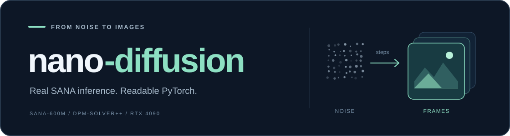
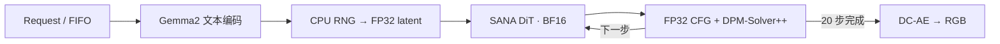

<p align="center">
  
</p>

<p align="center">
  <strong>用读得懂的代码，运行真实扩散模型。</strong><br>
  受 nano-vLLM 启发，约 580 行 Python 实现 SANA-600M 推理主路径，并在单张 RTX 4090 上对照 SGLang Diffusion。
</p>

<p align="center">
  <a href="https://github.com/Micdiane/nano-diffusion/actions/workflows/tests.yml"></a>
  <a href="https://huggingface.co/Efficient-Large-Model/Sana_600M_512px_diffusers"></a>
  <a href="benchmarks/README.md"></a>
  <a href="LICENSE"></a>
</p>

<p align="center">
  <a href="#quick-start">快速开始</a> ·
  <a href="#rtx-4090-benchmark">4090 实测</a> ·
  <a href="#how-it-works">工作原理</a> ·
  <a href="#read-the-code">源码导读</a>
</p>

<p align="center">
  
  
  
  <br><sub>本项目真实生成 · SANA-600M · 512 × 512 · 20 steps · seeds 42 / 43 / 44</sub>
</p>

## Highlights

- **真实模型**：加载固定版本的 SANA-600M、Gemma2 和 DC-AE 预训练权重，已在 4090 上生成图像。
- **可读核心**：自己实现 DiT 前向、请求状态、FIFO 调度、噪声初始化和 CFG；复用官方文本编码器、VAE 与 DPM-Solver 数值实现。
- **可核查对照**：提交每次测量的原始数据、生成样例、权重 SHA-256 和完整环境版本。
- **明确学习主线**：从真实 eager 基线深入 CUDA Graph、投影融合和 Triton AdaLN，见[源码学习路线](docs/source-guide.md)。

## Quick Start

使用 **Python 3.12** 和支持 CUDA 的 PyTorch。以下模型完整下载约 8.9 GB；本次单卡运行的 PyTorch 峰值 allocated 显存约 8 GiB。

```bash
git clone https://github.com/Micdiane/nano-diffusion.git
cd nano-diffusion
python -m venv .venv
source .venv/bin/activate
python -m pip install -e .

python scripts/download_model.py
python -m nanodiffusion \
  --checkpoint models/Sana_600M_512px_diffusers \
  --prompt 'A small red panda drinking tea in a bamboo forest, watercolor painting' \
  --seed 42 --output outputs/panda.png
```

CLI 保存 PNG 和同名参数 JSON。下载固定到 [`83d7a19`](https://huggingface.co/Efficient-Large-Model/Sana_600M_512px_diffusers/tree/83d7a190bfd1fd070570a793d2dab5c7a3231b9d)，推理只读取本地权重。

```python
from nanodiffusion import Diffusion, SamplingParams
from nanodiffusion.models.sana import SanaModel

with Diffusion(SanaModel("models/Sana_600M_512px_diffusers")) as engine:
    result = engine.generate("A boat on a calm lake", SamplingParams(seed=42))[0]

print(result.images.shape)      # [1, 512, 512, 3], CPU float32, [0, 1]
print(result.num_model_calls)   # 40: 20 steps × 2 CFG branches
```

## RTX 4090 Benchmark

**2026-09-26 实测**：单卡、batch=1、512px、20 步、CFG=4.5。3 次预热，3 个提示词各测 4 次。两个引擎依次运行，关闭编译、CUDA Graph、缓存和 CPU offload。

| 引擎 | 吞吐 ↑ | 平均延迟 ↓ | 去噪 GPU 时间 ↓ | 峰值 allocated 显存 |
| --- | ---: | ---: | ---: | ---: |
| nano-diffusion | **0.699 images/s** | **1.430 s** | **1.281 s** | 7.967 GiB |
| SGLang native pipeline（组件对齐） | 0.612 images/s | 1.635 s | 1.513 s | 7.970 GiB |

这次受控实验中 nano 的吞吐为 **1.14×**。为对齐计算，SGLang 通过 `loaded_modules` 使用同样的 HF Gemma2/DC-AE，并配置 FP32 噪声、latent 和 CFG；其 DiT、执行阶段与 scheduler wrapper 仍使用原生实现，上游源码未修改。端到端计时覆盖进程内完整推理及 CPU 输出，不含加载、预热、PNG 写盘或 HTTP。

**这是固定 eager 小负载的对比。** 不代表 SGLang 默认整条 pipeline、开启编译/图捕获后的性能或多请求服务吞吐。三组图像 PSNR 为 **33.91–43.23 dB**，输出并非逐位相同；PSNR 只衡量一致性，不等价于生成质量评分。

[实验方法与重跑命令](benchmarks/README.md) · [nano 原始数据](benchmarks/rtx4090/nano.json) · [SGLang 原始数据](benchmarks/rtx4090/sglang.json) · [图像差异](benchmarks/rtx4090/comparison.json)

## How It Works



SANA 把 512px 图像压缩为 `32 × 16 × 16` latent。DiT 的 28 个 block 组合 **ReLU 线性注意力、文本 cross-attention、GLUMBConv 和 AdaLN**。参数名称与真实检查点对应，严格加载全部权重。

<details>
<summary><strong>设计边界与精度约定</strong></summary>

- 一次运行一个图像请求；`add_request()` / `step()` 可逐步观察状态，[示例](examples/trace_requests.py)展示两条请求的调度。
- 每条请求拥有独立 CPU generator 与 DPM-Solver 历史。CFG=1 只执行正条件分支，CFG>1 顺序执行两个分支。
- Gemma2 使用 BF16 eager attention，保留 logit softcapping；文本固定右侧 padding 到 300 token，无 prompt enhancement。
- DiT 为 BF16，初始噪声、CFG、latent 与 VAE 为 FP32。采样使用检查点原始 DPM-Solver++ 配置，flow shift=3。
- 当前验证范围为 SANA-600M 512px；尚未实现批处理、训练、分布式或视频模型。旧 toy DiT 和未实测 Wan 路径已移除。

</details>

## Read the Code

| 顺序 | 文件 | 阅读重点 |
| :---: | --- | --- |
| 01 | [config.py](nanodiffusion/config.py) · [request.py](nanodiffusion/request.py) | 参数、条件、latent 与多步历史 |
| 02 | [engine.py](nanodiffusion/engine.py) · [scheduler.py](nanodiffusion/scheduler.py) | 入队、逐步执行、异常释放 |
| 03 | [runner.py](nanodiffusion/runner.py) | RNG、精度、CFG、采样循环 |
| 04 | [sana.py](nanodiffusion/models/sana.py) | 真实组件加载与检查点采样器 |
| 05 | [sana_transformer.py](nanodiffusion/models/sana_transformer.py) | 约 170 行真实 DiT 前向 |
| 06 | [sglang_backend.py](benchmarks/sglang_backend.py) | SGLang 对齐项与执行边界 |

更详细的公式、SGLang 源码映射与 4090 深挖路线见[源码导读](docs/source-guide.md)。

## Validation

```bash
python -m unittest discover -s tests -v
python scripts/validate_checkpoint.py --checkpoint models/Sana_600M_512px_diffusers
```

9 项 CPU 测试覆盖模型数学、mask、CFG、RNG、调度与异常处理。另已完成真实 4090 检查：六组 DiT 前向与 Diffusers **逐元素一致**；与其完整 pipeline 对照的图像 PSNR 为 **36.93 dB**。完整轨迹差异来自顺序 CFG 与 batched CFG 的计算布局，见[实际验证记录](benchmarks/checkpoint-validation.json)。

## Acknowledgements

[nano-vLLM](https://github.com/GeeeekExplorer/nano-vllm) 的可读推理引擎设计；[SANA](https://github.com/NVlabs/Sana) 的模型与权重；[Diffusers](https://github.com/huggingface/diffusers) 的组件和数学参考；[SGLang Diffusion](https://github.com/sgl-project/sglang/tree/main/python/sglang/multimodal_gen) 的原生系统实现。

代码采用 [Apache-2.0](LICENSE)，上游来源见 [NOTICE](NOTICE)。模型权重单独下载，遵循其原始许可。
