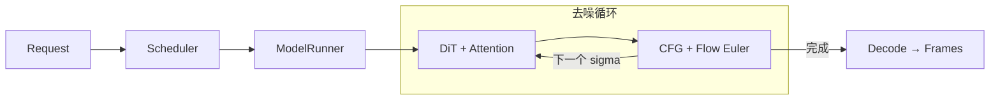

<p align="center">
  
</p>

<p align="center">
  <strong>把扩散推理的每一步，变成读得懂的代码。</strong><br>
  一个受 nano-vLLM 启发的小型推理引擎，从请求调度一路读到 CFG、采样器与 Attention。
</p>

<p align="center">
  <a href="https://github.com/Micdiane/nano-diffusion/actions/workflows/tests.yml"></a>
  <a href="pyproject.toml"></a>
  <a href="https://pytorch.org/"></a>
</p>

<p align="center">
  <a href="#quick-start">快速开始</a> ·
  <a href="#how-it-works">工作原理</a> ·
  <a href="#read-the-code">源码导读</a> ·
  <a href="#model-adapters">模型适配</a> ·
  <a href="#development">开发与验证</a>
</p>

---

## Highlights

- **小而可读** — 约 850 行 Python，分开请求、调度、执行、模型、采样器和后端。
- **从 CPU 开始** — 自带无需权重的随机小 DiT，可以直接跟踪完整推理流程。
- **看见采样过程** — 独立实现噪声初始化、CFG 与 Flow Euler，每次 `step()` 推进一步。
- **连接真实组件** — 提供 Wan2.1 T2V 适配器，以及小 DiT 的可选 SageAttention 接口。

## Quick Start

需要 **Python 3.10+**、**PyTorch 2.4+**。默认示例在 CPU 上运行，不下载模型权重。

```bash
git clone https://github.com/Micdiane/nano-diffusion.git
cd nano-diffusion
python -m pip install -e .

python -m nanodiffusion --frames 3 --steps 4 --output outputs/toy.pt
```

生成的 `toy.pt` 包含 `frames`、`latents` 和 `metadata`，同名 `toy.json` 保存可读元数据。帧张量为 `[1, 3, 32, 32, 3]`，FP32，像素范围 `[0,1]`。

> [!NOTE]
> 默认小 DiT **没有训练**，输出是用于观察张量与控制流的诊断图案，不具备语义图像或视频生成能力。

### Python API

```python
from nanodiffusion import Diffusion, SamplingParams
from nanodiffusion.models.toy import ToyAdapter

params = SamplingParams(num_frames=3, num_steps=4, seed=42)

with Diffusion(ToyAdapter()) as engine:
    result = engine.generate("A boat on a lake", params)[0]

print(result.frames.shape)       # torch.Size([1, 3, 32, 32, 3])
print(result.num_model_calls)    # 8：默认 CFG 每步计算两个分支
```

想观察两条请求怎样依次运行？执行 `python -m examples.trace_requests`，或直接阅读 [示例代码](examples/trace_requests.py)。

## How It Works



`Scheduler` 管理 FIFO 队列和单个运行中的请求；`ModelRunner` 准备模型输入，并保持 FP32 latent 状态。每一步调用模型预测速度场，合成 CFG，再更新 latent；最后解码为 CPU 帧张量。

<details>
<summary><strong>展开：两行采样公式与时间表</strong></summary>

采用 `x_sigma = (1-sigma)*x_data + sigma*noise`，模型预测 `dx/dsigma`，从 `sigma=1` 积分到 `0`：

```python
v_cfg = v_negative + guidance_scale * (v_positive - v_negative)
x_next = x_current + (sigma_next - sigma_current) * v_cfg
```

CFG=1 只计算正条件分支；CFG>1 顺序计算两个分支。时间表由 `linspace(1, 1/1000, steps)` 经 `shift*sigma / ((1-sigma)+shift*sigma)` 变换后追加终点 0，模型时间为 `1000*sigma`。

这是本项目的一阶 Flow Euler 基线，不等同于 Wan 官方 UniPC 的采样结果。每条请求使用独立 CPU generator，初始噪声不受队列顺序影响；不同硬件和后端的最终结果不保证逐位一致。

</details>

<details>
<summary><strong>展开：请求生命周期与实现范围</strong></summary>

- `add_request()` 入队，`step()` 推进一个去噪步骤；首步还包括文本编码，末步还包括解码。
- `generate()` 要求队列空闲。模型或进度回调异常会释放当前请求，保留 waiting 队列，可继续 `step()` 或 `close()`。
- 使用 `with Diffusion(...)` 调用清理接口；Wan 卸载组件，toy 权重随模型对象生命周期释放。
- 当前为单请求顺序执行，尚无 continuous batching、KV/TeaCache、训练或分布式逻辑。
- 小 DiT 用 UTF-8 字节 embedding 均值作为文本条件、随机卷积与插值作为 RGB decoder，用于学习接口和张量布局。

</details>

## Read the Code

按这条路线读，可以把一次请求追到底：

| 顺序 | 入口 | 重点 |
| :---: | --- | --- |
| 01 | [config.py](nanodiffusion/config.py) · [request.py](nanodiffusion/request.py) | 参数、latent、条件与步数怎样组织 |
| 02 | [engine.py](nanodiffusion/engine.py) · [scheduler.py](nanodiffusion/scheduler.py) | 请求怎样入队、执行与完成 |
| 03 | [runner.py](nanodiffusion/runner.py) | 文本编码、输入精度、CFG 和解码怎样串起来 |
| 04 | [sampler.py](nanodiffusion/sampler.py) | sigma 时间表与 Euler 更新怎样对应公式 |
| 05 | [base.py](nanodiffusion/models/base.py) · [toy.py](nanodiffusion/models/toy.py) · [wan.py](nanodiffusion/models/wan.py) | 同一个接口怎样连接小 DiT 与 Wan 组件 |
| 06 | [attention.py](nanodiffusion/attention.py) | Q/K/V 布局与 SDPA、SageAttention 后端边界 |

## Model Adapters

| 路径 | 用途 | 当前验证范围 |
| --- | --- | --- |
| **Toy DiT + SDPA** | 无权重的 CPU 学习入口 | 单元测试与命令行示例通过 |
| **Wan2.1 T2V** | 接入 Diffusers 预训练组件 | fake 组件契约已验证；真实权重与 GPU 路径未实测 |
| **Toy DiT + SageAttention** | 阅读低精度 Attention 的接入方式 | 接口已实现；GPU 扩展未实测 |

<details>
<summary><strong>Wan2.1 T2V · 安装、运行与组件约束</strong></summary>

在适配 CUDA 的独立环境中安装可选依赖，准备 `Wan-AI/Wan2.1-T2V-1.3B-Diffusers` 格式的本地模型目录：

```bash
python -m pip install -e '.[wan,video]'
python -m nanodiffusion --model wan \
  --checkpoint /path/to/Wan2.1-T2V-1.3B-Diffusers \
  --device cuda --dtype bfloat16 \
  --height 256 --width 256 --frames 17 --steps 30 --cfg 5 --shift 3 \
  --prompt 'A small boat drifting on a calm lake' \
  --output outputs/wan.pt --mp4 outputs/wan.mp4
```

- 仅显式传入 `--allow-download` 时允许远程下载；去掉 `--mp4` 可只保存张量，无需视频导出依赖。
- 支持单 transformer、16 通道的 Wan2.1 T2V 布局；高宽为 16 的倍数，帧数为 `4*n+1`。目标为 1.3B，不提供 14B 部署保证。
- 默认按文本编码器 → DiT → VAE 顺序卸载整组件，`--no-offload` 保持常驻；尚无逐层卸载或 VAE tiling。
- VAE 使用 FP32，解码前恢复 `latent * latents_std + latents_mean`；DiT 保留加载器的混合精度例外。
- `WanPipeline` 仅用于加载组件；CFG、采样循环和数值积分由本项目控制。

示例尺寸用于检查接口，未验证画质或 4090 显存占用。Wan 当前使用 Diffusers 原生 SDPA。

</details>

<details>
<summary><strong>SageAttention · 可选后端</strong></summary>

在兼容的 CUDA 环境中安装 [SageAttention](https://github.com/thu-ml/SageAttention) 后，可运行：

```bash
python -m nanodiffusion --device cuda --dtype float16 --attention sage
```

该选项只接入小 DiT，要求 CUDA FP16/BF16、head_dim 64/128、相同 head 数，使用非 causal Attention。SageAttention 属于近似低精度计算，不保证与 SDPA 输出一致。

</details>

## Development

```bash
python -m unittest discover -s tests -v
```

**32 项 CPU 测试**覆盖解析积分、CFG、随机种子、异常清理、Attention 数学参考、CLI 输出及 Wan 组件契约。[GitHub Actions](https://github.com/Micdiane/nano-diffusion/actions/workflows/tests.yml) 在 Python 3.11、3.12 上运行测试和示例；真实模型质量与 GPU 性能不在这些测试的验证范围内。

## Acknowledgements

- [nano-vLLM](https://github.com/GeeeekExplorer/nano-vllm) — 小型推理引擎的分层与可读性设计。
- [Diffusers](https://github.com/huggingface/diffusers) — Wan 模型组件及 pipeline 语义参考。
- [SGLang Diffusion](https://github.com/sgl-project/sglang/tree/main/python/sglang/multimodal_gen) — 生成推理系统的进阶阅读。
- [Mini-SGLang](https://github.com/sgl-project/mini-sglang) — Radix Cache 与调度重叠的 LLM 教学参照。
